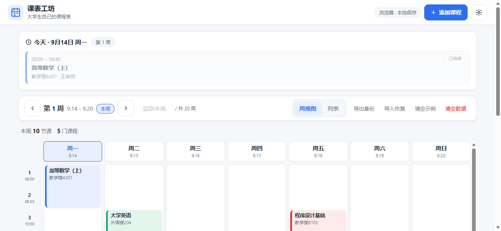
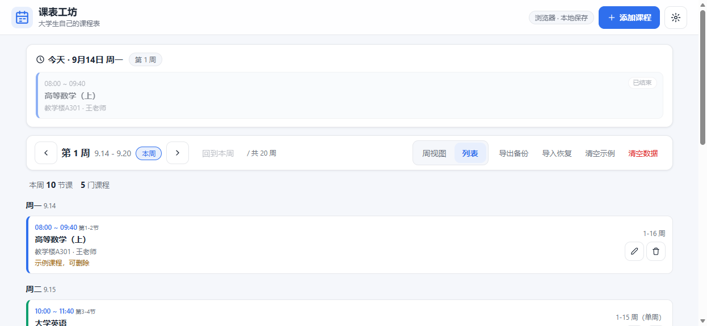
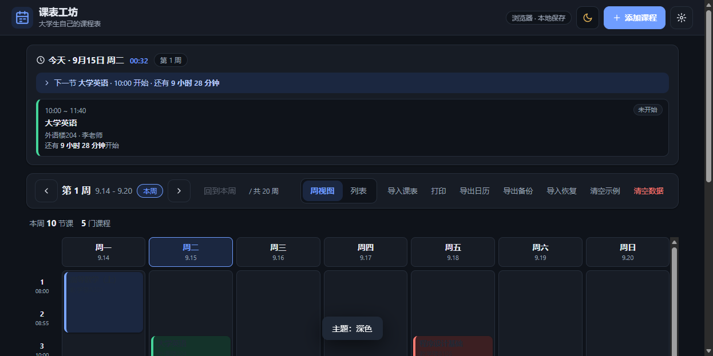
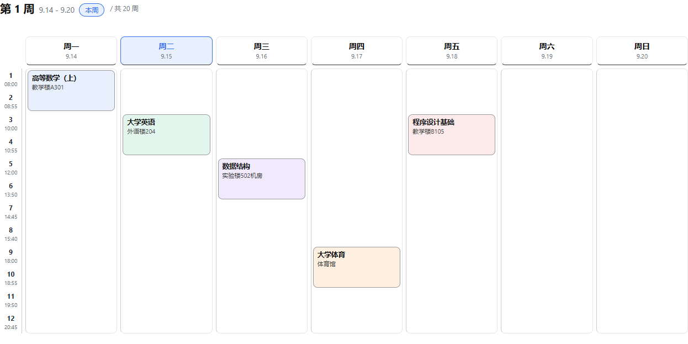
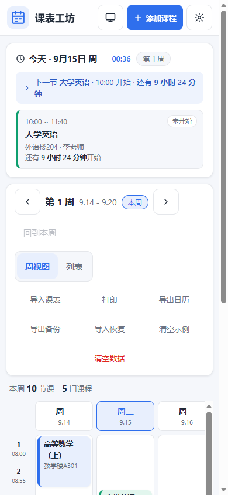
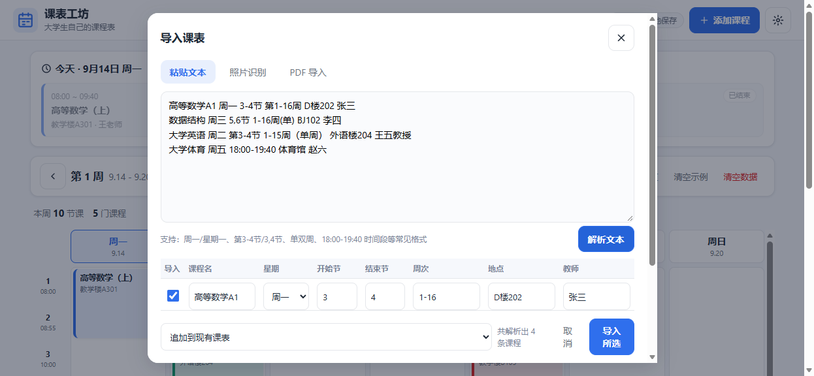
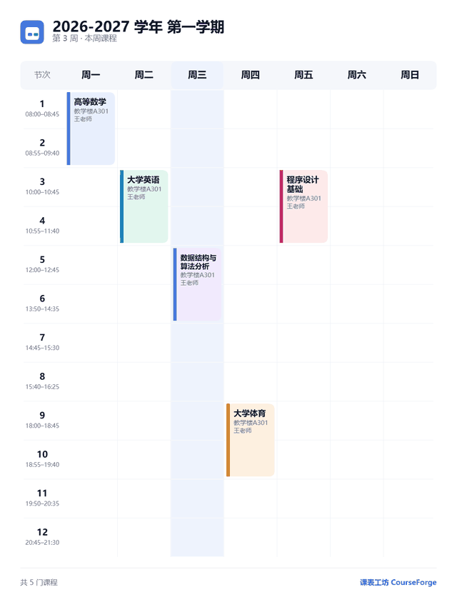
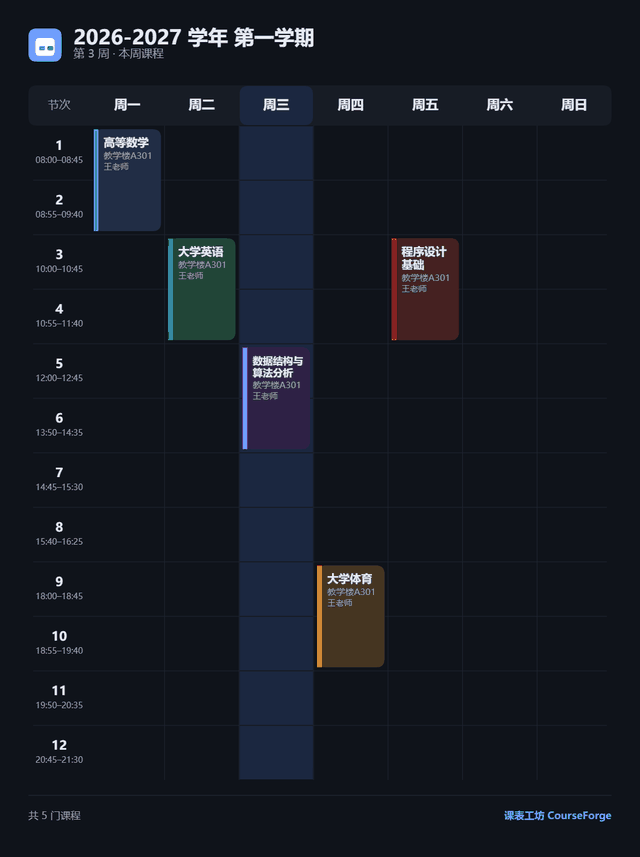
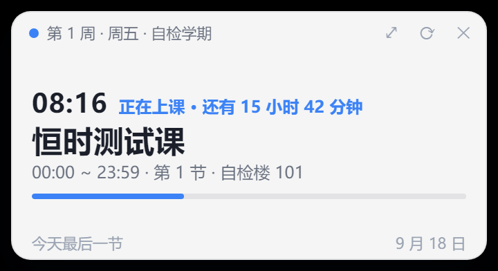

# 课表工坊 CourseForge

> 大学生自制课程表平台 · 网页版 + 桌面端 · 零依赖 · 数据完全本地

[](https://github.com/kevin0521-wjw/courseforge/actions/workflows/ci.yml)


一份属于自己的、不依赖任何教务系统的课程表。**网页版**双击即用，**桌面端**（Electron）一键启动，数据 100% 存在本地，不上传任何服务器。

## ✨ 特性

- 🗓 **周视图课程网格**：周一至周日 × 每日节次，点击空白格子即可添加课程；可一键切换只看周一至周五
- 📥 **智能课表导入**：教务系统直连（桌面端）/ 照片 OCR / PDF / 粘贴教务系统文本，自动识别课程、时间、地点、教师，确认后一键入库
- 📍 **今日课程置顶**：打开页面第一眼就是今天的课，自动标注「进行中 / 未开始 / 已结束」
- ⏱ **上课进度与倒计时**：今日课程显示实时进度条、剩余时间、下一节开课倒计时（每分钟刷新，页面隐藏时暂停）
- ⏰ **上课提醒**：课前可选「上课时 / 5 / 10 / 15 / 20 / 30 分钟前」弹系统通知；网页端与桌面端共用同一套判定，默认关闭（通知授权只能由用户点击触发）
- 🎌 **放假与调休标记**：在「今天」面板一键标记「今天放假 / 调休补课」——放假当天不提醒，**调休补课的周末照常提醒**；不联网拉节假日表，各校调休本来就不一样
- 🔢 **自动周次计算**：设置学期开始日期，自动算出当前是第几周，支持单双周
- 🏫 **作息预设**：内置上海大学官方 12 节作息（来自教务部文件），也可用通用预设
- ⚠️ **时间冲突检测**：保存时自动检查同一周同一天节次是否重叠，防止排课撞车
- 🎨 **8 色课程卡片**：不同课程不同颜色，一眼区分，深色模式下自动切换配色
- 🌗 **深色模式**：跟随系统 / 浅色 / 深色 三态可切，首屏渲染前应用主题，不闪白
- 🗓 **导出系统日历**：一键导出 `.ics`，双击导入 iOS / 安卓 / Google / Outlook 日历，带 10 分钟上课提醒
- 🖨 **打印课表**：A4 横向打印样式，隐藏所有界面元素、保留课程配色，可直接打印贴墙
- 🖼 **课表分享图片**：一键导出 1080×1446 的 PNG（微信 / 朋友圈竖图基准），不用再截图带上地址栏；可选本周 / 整学期、浅色 / 深色，纯 Canvas 手绘不引图表库；支持**直接复制到剪贴板**（聊天窗口粘贴即发，不支持的环境会引导改用保存）。同一天撞车的课自动并排分成泳道，课名放不下会折行并降一档字号（不会切成「数据结…」这种读不出来的样子）
- ⏳ **考试与事件倒计时**：在设置里登记考试和自定义事件（名称 + 日期 + 时间），首页紧跟「今日」面板出现一条倒计时 chip——今天的考试红色高亮，考试用警示色、普通事件用信息色。7 天内的考试还会自动出现在**系统托盘提示**和**桌面挂件**上；7 天内的考试/日程**每天弹一次系统通知**（弹过当天不再重复，与上课提醒开关互相独立）；添加考试的当下立刻收到「X 天后」反馈。考完试自动消失，不用手动清理。事件跟学期走，切学期、备份、导出都一起带上
- 🖥 **桌面常驻小组件**（桌面端）：在屏幕角落放一块课表挂件，显示下节课的课名、时间、地点与**秒级倒计时**；无边框、置顶、不占任务栏，可拖到任意位置并被记住。放假时说「今天放假」并把下次课顶上来，没开学时说「距开学还有 N 天」——而不是一律显示「没有课」
- 📌 **系统托盘常驻**：托盘提示直接写着「下一次课是什么、还有多久」，菜单可随时显示 / 隐藏挂件或打开课表。**关掉主窗口不会退出应用**，点一下托盘图标就能把课表唤回来
- 📚 **多学期管理**：一个工作台管理全部学期，新建 / 切换 / 重命名 / 删除，各学期课程与作息互相独立；旧数据自动迁移
- 💾 **数据本地存储**：浏览器 localStorage / 桌面端本地存储，关闭不丢
- ☁️ **WebDAV 云同步（可选）**：自备服务器（坚果云 / Nextcloud / 群晖均可），手动「上传备份 / 从云端恢复」两键；不填配置这个功能就不存在，数据默认仍全本地。桌面端由主进程代发请求（无跨域限制），密码走系统级加密存储；网页端尽力而为、被 CORS 拦时明确提示改用桌面版。恢复前安检云端载荷并列出「云端 N 学期 / M 门课」再确认
- 🔄 **检查更新（桌面版）**：设置抽屉一键查 GitHub Releases；发现新版本给官方下载页链接，自己决定何时升级。**不静默下载安装**（安装包未签名，静默升级必被系统拦）；网页版刷新即是最新，该功能只在桌面端出现
- 📤 **一键备份恢复**：导出 JSON 备份、导入恢复，换设备迁移只需一个文件
- 📱 **移动端适配**：手机浏览器打开即可使用；触屏点击区 ≥ 44px、输入字号 ≥ 16px
- 📲 **PWA**：可添加到手机主屏幕当 App 用，Service Worker 离线缓存，断网可打开；图标各尺寸齐备（含 iOS 专用的 PNG 与 Android 自适应 maskable）
- 🧪 **自带测试**：579 项 `node --test` 测试（含 jsdom 全流程与真机页面夹具回归），CI 自动跑

## 🖼 界面预览

| 桌面端 · 周视图 | 桌面端 · 列表视图 |
| --- | --- |
|  |  |

| 深色模式 | 打印课表（A4 横向） |
| --- | --- |
|  |  |

| 移动端 · 周视图（390px） | 移动端 · 列表视图 |
| --- | --- |
|  |  |

| 智能导入 · 识别结果确认表 |
| --- |
|  |

| 分享图片 · 浅色 | 分享图片 · 深色 |
| --- | --- |
|  |  |

| 桌面小组件（真实截图） |
| --- |
|  |

> 分享图样张由 `npm run check:share` 在**真实浏览器里出图后落盘**（`SHARE_OUT=<目录>`），
> 桌面小组件样张由 `WIDGET_OUT=<目录> npm run check:desktop` 从**真实运行的窗口里截图**落盘
> ——所以上面这些就是功能本身产出的图，不是另画的示意图。

## 📥 智能课表导入

工具栏「导入课表」支持四种来源，识别结果先进入**确认表格**（可勾选、可修改任一字段），点「导入所选」才入库：

| 来源 | 用法 | 说明 |
| --- | --- | --- |
| 🏫 教务直连 | 桌面端：填教务系统网址 + 账号密码 → 「一键登录并取课表」 | 自动登录后**优先走教务系统的数据接口**（字段明确、识别最准），接口不可用才退回解析课表页面；**仅桌面端**（网页版受同源策略限制） |
| 📋 粘贴文本 | 从教务系统网页复制课表粘贴 → 「解析文本」 | 网页版推荐，识别最准 |
| 📷 照片识别 | 课表拍照 / 截图 | Tesseract.js 中文 OCR，首次需联网加载约 15MB 引擎 |
| 📄 PDF 导入 | 课表 PDF 文件 | 文字版直接提取；扫描版自动转图片走 OCR |

解析器支持的写法（每行一门课，一行可写多个星期）：

```
高等数学A1 周一 3-4节 第1-16周 D楼202 张三
数据结构 周三 5,6节 1-16周(单) BJ102 李四
线性代数 周二,周四 1-2节 1-16周 教学楼B105 钱七
大学体育 周五 18:00-19:40 体育馆 赵六        ← 时间段自动映射节次
```

支持：`周一/星期一/礼拜一`、`第3-4节/3,4节/5-6节`、`1-16周/单周/双周/1-8,10-16周`、`18:00-19:40`（按作息表映射节次）、全角字符自动归一化。

> **关于教务直连**：浏览器里 JS 受同源策略限制，拿不到教务系统页面，所以这项能力只做在桌面端 ——
> 由 Electron 主进程开一个独立窗口完成登录与取数。课表放在 iframe 里也能读到（同源 iframe 会一并取回）。
> 网页版请用「粘贴文本 → 解析」，识别效果完全相同。
>
> **自动登录是怎么做的**：不自己实现教务系统的 RSA 加密，而是**复用学校页面自己的登录逻辑** ——
> 主进程在专用窗口里填好 `#yhm` / `#mm`，然后点页面上的登录按钮，剩下交给学校自己的 JS。
> 这样做的理由很实际：自己拼加密参数出错时，服务端只会回「用户名或密码错误」，
> 和真输错密码**完全无法区分**，调试时会被带偏，还可能因为连续失败触发账号锁定。
> 代价只是登录页改版时要跟着改选择器 —— 而选择器一坏就是「找不到表单」的明确报错，不会伪装成密码错误。
>
> **账号放在哪里**：勾选「记住账号」后，用户名与密码用 Electron `safeStorage` 加密后存在本机
> （Windows 走 DPAPI，密钥绑定当前 Windows 账户 —— 文件被拷到别的机器/别的账户都解不开）。
> 密码**只经过一次 IPC**，既不进网页的 localStorage，也不回传给页面（状态查询只回用户名）。
> 本机加密能力不可用时会**拒绝保存**，绝不降级成明文。随时可以点「忘记账号」清除。
>
> **学校开了验证码怎么办**：会自动停下并提示你到窗口里手动登录，之后点「重新取课表」——
> 不猜验证码，也不反复重试（重试只会白送失败次数）。


## 🚀 快速开始

### 方式一：网页版（零依赖，推荐先试这个）

直接双击打开 `web/index.html`，或者用仓库根目录的静态服务器：

```bash
npm run start:web        # 启动本地服务器，浏览器打开 http://localhost:5173
```

不想装 Node？直接打开 `dist/CourseForge-standalone.html`（单文件打包版，可拷贝到任何设备）。

#### 用手机真机测（内网穿透）

手机上访问不到电脑的 `127.0.0.1`；而「添加到主屏幕」这类 PWA 能力**必须走 HTTPS**，
用局域网 IP 也不行。`npm run tunnel` 一条命令就能把本地服务暴露成公网 HTTPS 地址：

```bash
npm run tunnel                 # 自动拉起本地服务 + 建立隧道
npm run tunnel -- --no-server  # 本地服务已在跑时，只建隧道
PORT=8080 npm run tunnel       # 换端口（默认 5173）
```

运行后输出里会给出形如 `https://xxxx.r16.vip.cpolar.cn` 的地址，**手机直接打开即可，不需要连同一个 WiFi**。
改完代码手机刷新就能看到，比每次重新部署快得多。

需要本机装好 [cpolar](https://www.cpolar.com/) 并登录（`cpolar authtoken <你的token>`）；
换路径可用 `CPOLAR_PATH` 环境变量指定。Ctrl+C 停止隧道。注意免费版分到的域名**每次启动都可能变**，以输出为准。

### 方式二：桌面端（Electron）

```bash
cd desktop
npm install              # 安装 Electron（首次较慢）
npm start                # 启动桌面应用
```

**启动不起来时（安全模式）**：如果应用在无显卡 / 容器 / 受限沙箱环境里闪退（典型报错
是 `GPU process isn't usable. Goodbye.`），用安全模式启动 —— 它会禁用硬件加速并关掉
Chromium 自带沙箱：

```bash
cd desktop
npx electron . --safe-mode            # 或设环境变量 COURSEFORGE_SAFE_MODE=1
```

> ⚠️ 安全模式会关掉 Chromium 的沙箱隔离。它只在「本机加载本地 `file://` 页面、不访问
> 外部网页内容」这个前提下可接受，**普通桌面环境请不要用**，保持默认即可。

### 打包桌面安装包（可选）

```bash
cd desktop
npm install            # 依赖里已含 electron-builder
npm run pack           # 快速验证：只出免安装目录 release/win-unpacked（不下载 NSIS）
npm run dist           # 出安装包 release/CourseForge-<版本>-setup.exe
```

打完**必须回来验产物** —— 「构建成功」这句话本身没有信息量：

```bash
npm run check:package  # 解开 app.asar 核对模块是否齐全、resources/web 是否带上
```

> **`--dir` 成功 ≠ 安装包能装。** `files` 白名单漏一个模块时，构建照样成功、exe 照样生成、
> 体积也正常，但用户装完双击就是 `Cannot find module`。`check:package` 就是拦这个的，
> 它还会核对产物的 `js/` 清单与源码是否一致，避免拿到旧产物误判成成功。

> **复用本地 Electron**：配置里设了 `electronDist`，直接拿 `node_modules/electron/dist` 打包，
> 不再去 GitHub 下载一份 100MB+ 的 Electron。

**下载 NSIS 组件超时**：electron-builder 要从 GitHub 取 NSIS / 7-Zip 组件，国内常见
`connect ETIMEDOUT`（`github.com` 被阻断时尤其明显）。换国内镜像即可：

```bash
ELECTRON_BUILDER_BINARIES_MIRROR=https://registry.npmmirror.com/-/binary/electron-builder-binaries/ \
  npm run dist
```

**受限沙箱里重复打包失败**：electron-builder 每次会清空输出目录，文件数超过 50 时
会被沙箱的批量删除策略拦下（`SAFE_DELETE_BULK_CONFIRM_REQUIRED`）。换个输出目录绕开：

```bash
npm run dist -- -c.directories.output=release-2
```

## 📦 数据与备份

| 操作 | 位置 | 说明 |
| --- | --- | --- |
| 自动保存 | 浏览器 localStorage | 每次修改立即写入，刷新/关闭不丢 |
| 导出备份 | 工具栏「导出备份」 | 生成 `courseforge-backup-日期.json` |
| 导入恢复 | 工具栏「导入恢复」 | 选择备份文件，确认后整库替换 |
| 清空数据 | 工具栏「清空数据」 | 二次确认后清空，请先导出备份 |

> 首次打开会预置 5 门示例课程，点「清空示例」一键移除。

## 🧱 项目结构

```
courseforge/
├── web/                    # 网页版（纯前端，零依赖）
│   ├── index.html          # 页面骨架
│   ├── manifest.webmanifest# PWA 清单（添加到主屏幕）
│   ├── sw.js               # Service Worker：离线缓存
│   ├── icon.svg            # 图标源（矢量，唯一真源）
│   ├── icon-*.png          #   位图图标：由 tools/make-icons.py 从 icon.svg 生成
│   │                       #   （iOS 的 apple-touch-icon 与 Windows 的 .ico 都不吃 SVG）
│   ├── icons.lock.json     #   记 icon.svg 的哈希：改了 SVG 忘了重生成时会被测试拦下
│   ├── css/style.css       # 样式（浅/深双主题、响应式、打印样式）
│   └── js/
│       ├── core.js         # 业务逻辑：周次计算/冲突检测/校验/作息预设（纯函数，可在 Node 直接测试）
│       ├── storage.js      # 存储层：localStorage 封装 + 内存兜底
│       ├── render.js       # 渲染层：数据 → HTML 字符串（纯函数，无 DOM 操作）
│       ├── parser.js       # 课表文本解析引擎：星期/节次/周次/地点/教师（纯函数，可单测）
│       ├── edu-html.js     # 教务课表解析：HTML 网格/转置/列表三种版面 + 正方接口 kbList（纯函数，可单测）
│       ├── importer.js     # 导入模块：教务直连 / 照片 OCR / PDF / 粘贴文本 → 确认表格 → 入库
│       ├── ics.js          # 日历导出：RFC 5545 生成（纯函数，可单测）
│       ├── share-image.js  # 分享图：数据 → 绘图指令（纯函数）→ Canvas 出图（纯手绘，不引图表库）
│       ├── widget.js       # 桌面小组件渲染层：把主进程给的视图画成 DOM（纯文案函数可单测）
│       └── app.js          # 调度层：事件绑定 / 状态管理 / 统一刷新入口 refreshAll()
│   └── widget.html         # 桌面小组件页面（仅桌面端加载；不引 core.js，判定全在主进程）
├── desktop/                # Electron 桌面端（复用 web/ 页面）
│   ├── main.js             # 主进程：窗口创建 + 教务自动登录 / 取课表 / 凭据 IPC
│   ├── edu-login.js        # 自动登录脚本与状态判定（纯函数，可单测；用户名密码走 JSON 转义防注入）
│   ├── cred-store.js       # 教务账号本机加密存储（safeStorage；加密不可用时拒绝保存而非降级明文）
│   ├── widget-store.js     # 托盘 / 挂件的数据中枢：复用 web/js/remind.js 算出「下节课」（纯逻辑，可单测）
│   ├── desktop-shell.js    # 托盘图标 + 小组件窗口（含 Electron 相关的坑与兜底）
│   ├── shell-layout.js     # 窗口位置夹取 / 偏好落盘 / 图标挑选（纯逻辑，可单测）
│   ├── preload.js          # 预加载：向页面注入桌面环境标识、教务直连能力与外壳开关
│   ├── preload-widget.js   # 小组件专用预加载：只暴露「取数据 / 隐藏自己 / 打开课表」三个方法
│   └── package.json
├── tests/                  # 测试（node --test，无需安装任何依赖）
│   └── fixtures/           #   PDF / 教务文本夹具（真实来源，姓名与学号已化名）
├── tools/                  # 开发脚本
│   ├── serve.mjs           #   本地静态服务器（npm run start:web）
│   ├── tunnel.mjs          #   内网穿透：把本地服务暴露成公网 HTTPS（npm run tunnel）
│   ├── build-standalone.mjs#   单文件打包
│   ├── make-icons.py       #   图标生成：icon.svg → PNG / ICO（唯一需要 Pillow 的脚本）
│   ├── check-dom.mjs       #   DOM / data-action / CSS 静态检查
│   ├── mutation-check.mjs  #   变异测试：故意改坏代码，确认断言真的会变红
│   ├── browser-selftest.mjs#   真机自检：headless 浏览器 + CDP 跑真实 PDF 导入链路
│   ├── share-image-selftest.mjs # 真机出图自检：headless 浏览器画分享图，数像素 + 真实字体度量
│   ├── desktop-selftest.mjs#   桌面端自检：真启动 Electron，用 CDP 验证 preload / IPC / 安全边界
│   ├── import-web-selftest.mjs#  网页版导入三链路真机自检（PDF / OCR / 教务引导）
│   ├── import-edu-selftest.mjs#  桌面端导入三链路真机自检（含本地假教务服务器端到端）
│   └── verify-package.mjs  #   打包产物校验：解 asar 头核对模块齐全、resources/web 与源码一致
├── docs/PROMPTS.md         # 🤖 AI 开发提示词手册（用 AI 继续迭代本项目必读）
├── docs/COMPARISON.md      # 📊 竞品对比与优化清单（功能矩阵 / 差异化定位 / 缺口优先级）
└── .github/workflows/      # CI：push 时跑测试 + 静态检查 + 变异测试 + 打包冒烟（不含出安装包，太重）
```

## 🖨 打印 / 日历 / 分享

| 能力 | 说明 |
| --- | --- |
| 🖨 打印课表 | 工具栏「打印」→ A4 横向；自动隐藏工具栏/今日面板/弹窗，保留课程配色与周次标签 |
| 🗓 导出日历 | 工具栏「导出日历」→ `courseforge-YYYYMMDD.ics`；按周展开为独立日程，含 10 分钟提醒 |
| 🖼 分享图片 | 工具栏「分享图片」→ 选「本周 / 整学期」与「浅色 / 深色」→ 预览 → 复制到剪贴板或保存 PNG |
| ☁️ 云同步（可选） | 设置抽屉「云同步」→ 填 WebDAV 服务器 / 用户名 / 应用密码 → 保存配置 → 「上传备份 / 从云端恢复」；恢复前列出云端内容并确认 |

> **云同步的边界**：不填服务器配置这个功能就不存在，数据默认仍全本地；备份就是一个 JSON 文件
> （`CourseForge/courseforge-workspace.json`），落在你自己的服务器上，不经过任何第三方。
> 桌面端由主进程代发请求（用户自备的 WebDAV 服务器普遍不开 CORS），密码走系统级加密存储
> （Windows 为 DPAPI，与教务账号同一套「只存密文、不回传」的规矩）；网页端能否使用取决于服务器的
> 跨域设置，被拦时会明确提示改用桌面版。

> 日历导出按**周次展开**而非 RRULE 重复规则：单双周、跳周等不规则周次也能精确表达，且 iOS / 安卓 / Google 日历 / Outlook 全兼容。

> **分享图为什么是手绘而不是截图**：截图会带上浏览器地址栏和工具栏，尺寸随窗口变化，
> 发到群里可读性完全看对方手机。分享图固定 1080×1446、按数据重排一次版式，
> 时间列带上真实起止时间，页脚还会说明「另有 N 门不在本周」。
>
> 导出深色图时会**独立于页面主题**决定配色：浅色页面里选「深色」也能得到一张真正的深色图。
> （这里踩过坑：课块底色原本直接取当前主题的 CSS 变量，浅色页面导深色图就成了
> 白底浅字 —— 课名整片看不见。现在深色主题下课块底色会转 HSL 压暗到固定亮度，
> 并由真机像素检查守住。）


## 🏗 架构设计

四层单向依赖，调用链必须是**有向无环图**（DAG），从架构上杜绝渲染函数互相调用导致的栈溢出：

```
app.js（调度层：事件 → 改数据 → refreshAll() 统一刷新）
  ├→ storage.js（存储层：读写 localStorage）
  ├→ render.js（渲染层：state → HTML 字符串，禁止直接写 DOM）
  │     └→ core.js（逻辑层：周次/冲突/校验，纯函数）
  └→ core.js
```

- 渲染函数之间**严禁互调**，所有联动刷新只经 `app.js` 的 `refreshAll()` 按固定顺序调度
- `core.js` / `render.js` 采用 UMD 导出，浏览器与 Node 环境通用，因此核心逻辑可以在没有浏览器的情况下被完整测试
- 用户数据永远先经过 `normalizeCourse() / normalizeSettings()` 清洗，再进入状态

## 🧪 测试

```bash
npm install              # 只为装 jsdom（可选，用于 DOM 全流程测试）；不装也能跑其余测试
npm test                 # 运行全部测试（node 内置 test runner）
npm run check:dom        # 静态检查：DOM id / data-action 接线 / CSS 结构 / 桌面端 IPC 通道
npm run check:mutation   # 变异测试：故意改坏被测代码，确认断言真的会变红
npm run check:browser    # 真机自检：headless Edge + CDP 跑一遍真实 PDF 导入链路
npm run check:share      # 真机出图自检：headless Edge 画分享图，数像素 + 真实字体度量（30 项）
npm run check:desktop    # 桌面端自检：真启动 Electron，验证 preload 注入 / IPC 往返 / 安全边界
npm run check:import-web # 网页版导入三链路真机自检：PDF（真文件）/ 照片 OCR（真引擎）/ 教务引导（需先 start:web）
npm run check:import-edu # 桌面端导入三链路真机自检：PDF（含 cfcmap:// 协议源取 CMap 与路径穿越拦截）/ OCR / 教务端到端（自带假教务服务器，不碰真教务）
npm run check:package    # 打包产物校验：解 asar 核对模块与 resources/web（未打包时自动跳过）
npm run build:standalone # 生成 dist/CourseForge-standalone.html 单文件版
npm run pack:desktop     # 打包桌面端（免安装目录）
npm run dist:desktop     # 打包桌面端（NSIS 安装包）
npm run verify           # 测试 + 静态检查 + 变异测试 + 打包冒烟 + 产物校验，一条命令跑完
```

> `check:browser` / `check:share` / `check:desktop` 不在 `verify` 里：它们要真实网络与图形环境
> （会拉起浏览器 / Electron），不适合当默认门禁，按需手动跑。
> `check:package` 在 `verify` 里，但**未打包时只打印一行提示并跳过**，不会在 CI 里造假失败。
>
> `check:browser` 补的是 Node 测试覆盖不到的那一段 —— 同源相对路径取 CMap、
> pdf.js worker 加载、各镜像在真实网络下的可达性（缺浏览器可用 `EDGE_PATH` 指定）；
> `check:share` 补的是**同一类缺口**，但对象是分享图：Node 测试里量文字宽度用的是
> 注入的估算函数（汉字按 1 个字宽、西文 0.55），浏览器用的是真 `measureText`，
> 两者在数字串上能差 6%——只有真机才暴露得出来。它还会去**数画布上的像素**：
> 「指令序列正确」和「画布上确实有那些颜色的像素」是两回事，
> `font` 少写 `px`、fillStyle 传空串、深色主题配成浅底白字，这几种情况下
> 指令全对、PNG 也完整，图却是坏的/看不清的，只有数像素拦得住。
> `SHARE_OUT=<目录> npm run check:share` 会把样图落盘到指定目录以便人眼复核。
>
> `check:desktop` 则验证静态检查做不到的部分 —— preload 是否真的注入了
> `window.CourseForgeDesktop`、桌面小组件窗口的 preload 是否只暴露极小能力面、
> `edu:*` / `shell:*` IPC 是否真的能往返、托盘是否真的创建、小组件窗口是否真的
> 打开并渲染出「下节课」、以及 `sanitizeUrl` 在真实调用链上是否真的拦得住
> `javascript:` / `file://` 这类协议（**54 项断言，含小组件真实截图的像素检查**；
> 需先在 `desktop/` 里 `npm install`）。它默认用**产品默认配置**启动（即用户双击
> 时的真实路径）；无 GPU / 容器等受限环境起不来时，加 `SAFE_MODE=1` 走安全模式重试：
> `SAFE_MODE=1 npm run check:desktop`。
>
> `WIDGET_OUT=<目录> npm run check:desktop` 会把小组件窗口的**真实截图**落盘到指定目录，
> 以便人眼复核那块挂件到底长什么样（README 的预览图就是它产出的，不是另画的示意图）。
>
> 打包配置里 `extraResources` 把 `build/icon.ico` 复制为运行时的 `tray.ico`
> ——托盘图标必须是独立文件：`build/` 目录本身不进安装包，只在打包时当资源用。
>
> 自检还能直接验**打包产物**（打包版走的是 `app.isPackaged` + `resources/web` +
> asar 内 preload，与开发态完全是两条路径，只验一条推不出另一条）：
> `PACKAGED_APP=desktop/release/win-unpacked/课表工坊.exe npm run check:desktop`。

> **运行时零依赖，依赖只在测试层**：`jsdom` 仅用于驱动真实 `index.html` 跑全流程测试，未安装时这些用例自动跳过（不阻断）。交付产物（网页版 / 单文件版 / 桌面端）不依赖任何 npm 包。

测试覆盖：跨年/跨月周次计算、单双周生成、节次冲突检测、课程校验、导入数据清洗、渲染字符串安全性（XSS 转义）、localStorage 异常兜底、课表文本解析（16 项）、ICS 日历生成（RFC 5545 折行/转义/跨年）、深色主题变量完整性、显示周末联动、移动端触屏硬指标（44px 点击区 / 16px 输入字号）、多学期工作区（v1→v2 迁移、增删改语义、切换不串台）、教务系统解析（HTML 网格/转置/列表三种版面 + rowspan 合并 + 一格多课 + script/注释干扰 + 降级提示；正方接口 kbList 字段别名/单双周/缺星期跳过/外层壳变体）、自动登录（用户名密码 JSON 转义防注入 + 验证码收手 + 失败文案回读）、账号本机加密存储（读写往返 + 磁盘无明文 + 无加密能力时拒绝保存 + 文件损坏兜底）、学期 UI 回归护栏（class 有样式 / 复合选择器点击区 / 动作已注册 / 改动必落盘）、上课提醒引擎（课前/上课瞬时/去重/跨天跨周/休眠恢复/单双周与调休边界）、考试提醒判定（7 天窗口边界/账本去重「每天一次而非一生一次」/坏输入不抛错/普通日程与考试话术区分；DOM 接线：添加考试即弹提示并记当日账本、窗口外不留账）、分享图剪贴板降级（不支持的环境明确引导改用保存且按钮恢复可点）、WebDAV 云同步（配置清洗协议白名单/云端载荷安检 20MB 上限/Basic 认证头 UTF-8/真起本地 http 服务器测 PUT·GET·302 重定向·401·404 的人话文案/恢复前确认与结构校验/密码「存过的用户名一致才可用」）、检查更新（semver 三段比较与 v 前缀/404 无 release 是预期态而非错误/tag 解析失败不当「已是最新」糊弄/html_url 只认 github.com 域否则回落固定发布页/403 限流人话/真起本地 http 服务器验 User-Agent 头/桌面桥显隐与「前往下载」链接/主进程第二道白名单兜底）、真机登录页夹具回归（用上大教务真实登录页 DOM 钉死选择器与填表脚本，学校改版即红）、CMap 源实试换源（vm 跑真 importer：首选源坏必须自动换下一个源、全坏必须明确转 OCR 而非静默空文字；桌面端 cfcmap:// 特权协议供给随包 CMap —— file:// 页面 fetch 不了本地资源，协议源必须排最前且 handler 防路径穿越）、图标产物护栏（PNG 尺寸 / maskable 四边不透明 / apple-touch-icon 必须是 PNG / ICO 含 256 档 / SW 预缓存覆盖 / 改了 icon.svg 必须重新生成）、单文件版构建护栏（真跑一遍构建，扫所有 `<link>`/`<script>` 确认没有残留外部引用）、分享图布局护栏（指令不越界 / 泳道不重叠 / 课块位置与节次对齐 / 课名折行截断且每行不超宽 / 页脚门数与图上课块数一致 / 深色课块底色与文字亮度差 ≥ 110 / fitText・wrapText・fitName・darkenForTheme 单测）、桌面小组件数据中枢（无数据/空课表/垃圾输入/正在上课与边界/倒计时归零/跨天称呼不重复「周」/未开学给距开学天数/学期结束/放假与调休/单双周/作息缺失与「今天本来没课」区分/item 必须带精确起止时刻供秒级倒计时）、窗口几何纯逻辑（屏外夹回可见区/只露小角算看不见/负坐标副屏合法/偏好原子写与损坏兜底）、小组件渲染层（文案纯函数 + 进度条 + 直接用精确时刻而非取整反推 + boot 按钮接线）、jsdom 全流程（打开页面 → 切周 → 新增课程 → 刷新持久化 → 新建/切换/重命名/删除学期 → 教务直连读回并入库 → 提醒开关落盘并回显 → 桌面小组件开关即时生效/失败回滚）。

> 当前 **589 项测试全部通过**；变异测试（`npm run check:mutation`，88 条变异）
> **护栏有效 85 · 假护栏 0 · 等价变异 1 · 跳过 2 · 无效判定 0** —— 除已登记的
> 等价变异与 2 条模式失配（源码改动后锚点没对上）外，每一处被删掉的代码都能让某条断言变红。
> 「假护栏 0」是硬要求：如果删掉某段代码测试仍全绿，就说明它没被守护，
> 要么补断言、要么显式登记为等价变异并写清理由，不能放着不管。
> 另：每条变异的测试执行带 300 秒超时 —— 若某条变异让测试死循环（真出过：
> 放假判定失效会让一个 jsdom 用例等不到状态翻转），会被击杀并计为无效判定，
> 而不是把整条测试管线挂死。汇总处还有一道分类自检：各分类之和必须等于
> 变异总数，双计/漏计会被当场拒绝出结论（真抓过：无效判定分支漏 continue
> 导致同一条变异被计入两个分类）。

## 🗺 路线图

- [x] **v0.2** 教务系统课表文本粘贴导入（自动解析）
- [x] **v0.2** 照片 OCR / PDF 导入
- [x] **v0.3** 深色模式（跟随系统 / 浅色 / 深色）
- [x] **v0.3** PWA 支持（添加到主屏幕、离线缓存）
- [x] **v0.3** 导出 `.ics` 系统日历
- [x] **v0.3** 今日课程实时进度与下一节倒计时
- [x] **v0.3** 打印课表（A4 横向）
- [x] **v0.3** 显示周末开关（周一到周五视图）
- [x] **v0.4** 多学期管理（新建 / 切换 / 重命名 / 删除，v1 数据自动迁移）
- [x] **v0.4** 教务系统直连导入（桌面端主进程代取页面，绕开浏览器跨域；支持网格/转置/列表三种版面）
- [x] **v0.5** 教务一键自动登录（复用学校页面自身登录逻辑）+ 结构化接口取课表 + 账号本机加密存储
- [x] **v0.5** 课程表分享图片生成（Canvas 手绘，不引图表库）
- [x] **v0.5** 考试倒计时 & 自定义事件（首页 chip + 托盘 + 挂件联动；7 天内每天提醒；分享图可复制到剪贴板）
- [x] **v0.5** 上课提醒（课前 N 分钟系统通知）+ 放假/调休标记（调休补课的周末照常提醒）
- [x] **v0.5** 应用图标（`icon.svg` → PNG / ICO 多尺寸；安装包不再顶着 Electron 默认图标，iOS 也能正确显示主屏图标）
- [x] **v0.5** 桌面托盘小组件 / 常驻提醒（托盘提示写「下一次课是什么、还有多久」；角落挂件显示下节课 + 秒级倒计时；放假/未开学给出明确文案而非一律「没课」）
- [ ] **v1.0** 安装包代码签名（当前未签名，首次运行会被 SmartScreen 拦一次）
- [x] **v1.0** 可选云同步（WebDAV，默认仍本地；手动上传/恢复，密码加密存储）
- [x] **v1.1** 检查更新（自研查 GitHub Releases，只提示 + 给官方下载链接，不静默安装）

> 路线图的取舍依据见 [docs/COMPARISON.md](docs/COMPARISON.md)（含 10 个同类开源项目的功能矩阵与缺口优先级）。

## 🤖 用 AI 继续开发

本项目按「AI 协作开发」规范搭建，[docs/PROMPTS.md](docs/PROMPTS.md) 收录了完整的提示词手册：功能迭代、Bug 修复、代码审查、测试补充、打包发布等模板，开箱即用。

## 🛠 二次开发约定

- 全部代码**零外部依赖**：不引 CDN、不引框架、不引字体库，界面图标全部内联 SVG
  （唯一的位图是**应用图标**，因为它必须满足平台硬要求：iOS 的 `apple-touch-icon`
  和 Windows 的 `.ico` 都不接受 SVG。位图是 `icon.svg` 的派生产物，由
  `tools/make-icons.py` 生成并入库，日常开发与 CI 都不需要 Pillow）
- 代码注释使用中文
- 新增逻辑优先放进 `core.js`（纯函数）并补充测试
- 移动端适配是硬性要求：按钮点击区 ≥ 44px，输入框字号 ≥ 16px
- 渲染层输出用户数据必须经过 `esc()` 转义

## 📄 协议

[MIT](LICENSE) © 2026 kevin0521-wjw
